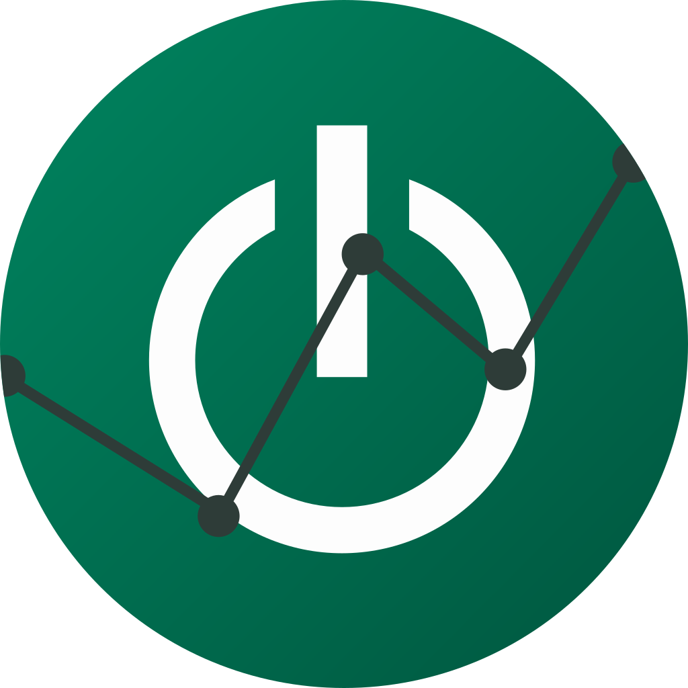

# OwnPlot

**OwnPlot** is a free and opensource data plotter software designed to work with OwnTech's dev board.

However, everybody can use this software as a data plotter with any devboard.

## How to use it

Go to the settings tab to set the data format that your devboard is sending.
Then select the right port and open it. You can pause both chart and terminal with the top right button.
Once you are done, you can close the port (it will close when you close the app anyway).

You can custom the chart layout under Chart Tab. Click on a channel in the legend to change its layout.

A record feature is also available. You have to click play under the record tab. Do not forget to download the file !

Send command to your devboard through the command tab ! You can add buttons if you have to send the same data regularly.

## Running the development environment

First of all, open the terminal of your choice.
If you are using Windows, we recommand the use of git bash https://www.git-scm.com/downloads

1. type: \
    `node --version`
    * If the command prompt tells you node isn't present on your computer, then download and install nodejs thru this website:
        https://nodejs.org/en/download/
    * If the version is inferior than version 14.x.x then you'll need to update nodejs. `nvm` is a great little piece of kit that will make your life a lot easier   https://github.com/nvm-sh/nvm
2. Clone the repository:
    * If you have a gitlab accound and a ssh key linked to this one, clone with this command instead: \
    `git clone git@gitlab.laas.fr:garthaud/ownplot.git`

    * Otherwise use this command: \
    `git clone https://gitlab.laas.fr/garthaud/ownplot.git`

3. Go the the newly created folder: \
`cd ownplot`

4. Install the decencies: \
`npm install`

5. Run the development environment: \
`npm start`

**Congrats!** 🥳 \
A window should be opened with OwnPlot.

If you are experiencing problems during the install, please post an issue and report the problem. This will greatly help us improve the user experience.

## Build for your plateform

Simply run `npm run make` \
The `.exe` / `.app` / `.deb` / `.rpm` file can be found in the `out` folder.
