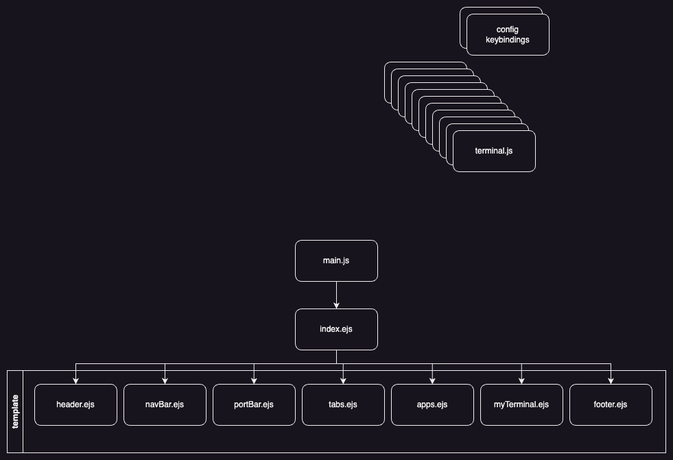

# Files description

## Main files
These files are located at the root of the repo.
- *main.js*
Program Starting Point. This file sets up the windows as well as default configurations. 
This also loads user configuration. This file will render *index.ejs*
- *index.ejs*
The main skeleton of OwnPlot. This file includes other *.ejs* files present in the template folder

## Template files
Files used to describe skeletons of the different parts of OwnPlot.
- *header.ejs*
This file includes stylesheets and some scripts. **description needed**
- *navBar.ejs*
The navigation hub of OwnPlot. This file permits to change the main view. **screenshot of the navbar**.
- *portBar.ejs*
**description needed**
- *tabs.ejs*
**description needed**
- *apps.ejs*
**description needed**
- *myTerminal.ejs*
**description needed**
- *footer.ejs*
Closing the HTML tag.

## Template files
