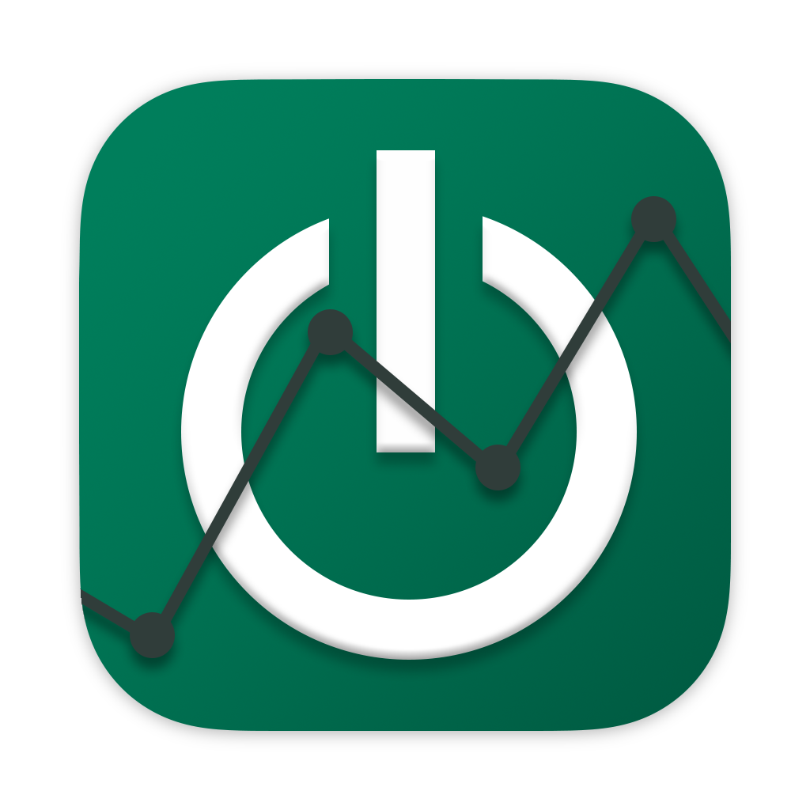

## Welcome to OwnPlot!
This documentation will help you use and develop for OwnPlot.

<figure markdown="span">
  { width="300" }
  <figcaption>OwnPlot is a Free and OpenSource plotter written in Electron</figcaption>
</figure>

## Documentation

The documentation is split between the [User Manual](user-manual/home.md) and the [Developer Manual](dev-manual/home.md)

[:fontawesome-solid-user: User Manual](user-manual/home.md)
{ .card }

[:fontawesome-brands-dev: Dev Manual](dev-manual/home.md)
{ .card }

### User Manual
The User Manual will guide you through all of OwnPlot's features.

### Development Manual
The Dev Manual will help you understand the architecture and will permit you to add features and contribute to OwnPlot's development.