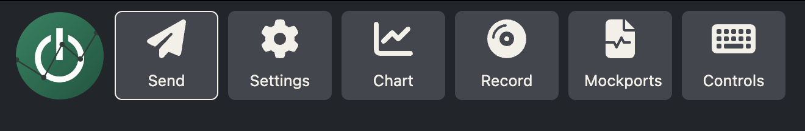

# Tabs
The tabs of OwnPlot splits all the settings and functions of the app between different pages.
{ width="300" }
### Send Tab
Purpose: The send tab is dedicated to "Send" data to the selected serial port.
The most important field is 
