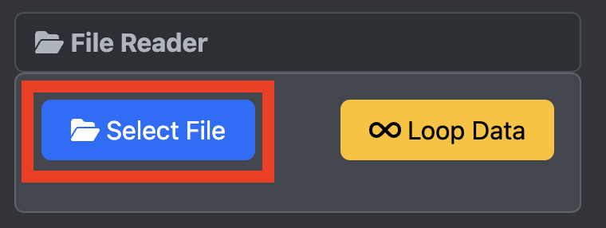
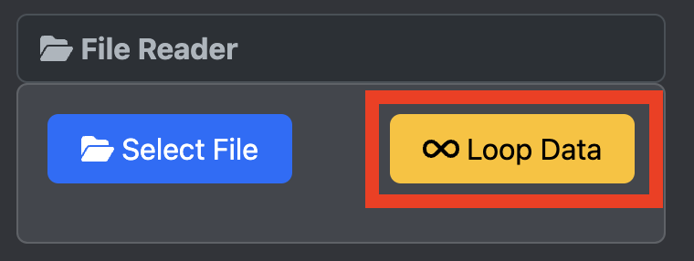

# Tabs
The tabs of OwnPlot splits all the settings and functions of the app between different pages.
{ width="300" }
### Send Tab
Purpose: The send tab is dedicated to "Send" data to the selected serial port.
The most important field is 

### Settings Tab

### Chart Tab

### Record Tab

### Mockports Tab

The **Mockports** tab hosts the setup of the Mockport 4 (File reader).

#### File reader

You can upload a file recorded from the Record tab and play it back.
{ width="300" }

!!! Note
	You have to select the Mockport 4 in the port selector in order to upload a record file.

By default, the data will be read once and the port will automatically close.
{ width="300" }
You can change this behavior by pressing the **Loop Data** button. This will read the available data in the provided file and restart the process every time the end file has been reached.

#### Interval
You can also change the interval of points using the **interval (ms)**.
the smaller the number, the more data points per second will appear in the graph.
{ width="300" }

### Controls Tab
The **Controls** tab enables you to set shortcuts for common actions.

| Shortcut         | Action                         | Manual action |
|------------------|--------------------------------|---------------|
| Ctrl + Enter     | Opens/Closes the current port  | click on the open/close button in the port bar |
| Ctrl + BackSpace | Clear the char/plotting data   | click on the clear button in the port bar |
| Ctrl + Space     | Run and stop plotting          | click on running/paused button in the port bar |
| Ctrl + digit 1   | switch to Tab1 (Send Tab)      | click on the Send Tab |
| Ctrl + digit 2   | switch to Tab2 (Settings Tab)  | click on the Settings Tab |
| Ctrl + digit 3   | switch to Tab3 (Chart Tab)     | click on the Chart Tab |
| Ctrl + digit 4   | switch to Tab4 (Record Tab)    | click on the Record Tab |
| Ctrl + digit 5   | switch to Tab5 (Mockports Tab) | click on the Mockports Tab |
| Ctrl + digit 6   | switch to Tab6 (Controls Tab) 	| click on the Controls Tab |