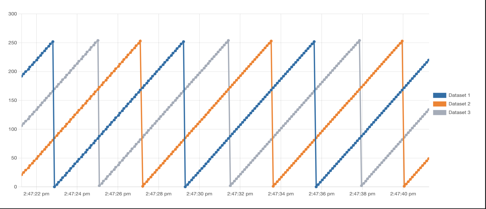

# Dev board demo code

In order to transmit data to OwnPlot, your device must send data through a serial port.
This serial port on dev boards is in most cases USB based.

This page will provide you with sample codes that will make those dev boards "talk" in the serial port.

# Sawtooth demo code
This code will generate sawteeth with ASCII formatting.

You can change the number of datasets by modifying the `#define numberOfTriangles 3` statement. The default value is 3.
=== "SPIN"
	TODO: SPIN demo sawteeth.
	``` C
		#define numberOfTriangles 3
		int main() {
			//TODO
			return 0;
		}
	```
=== "Arduino"
	Here is the demo code. Tested on an Arduino Uno and Mega.
	``` arduino
	#define numberOfTriangles 3
	uint16_t maxValue = 256;
	uint8_t triangles[numberOfTriangles];
	uint8_t numberPoints = 4;
	int incomingByte;
	uint8_t state = 1;

	void setup() {
		Serial.begin(115200);
		initTriangles();
	}

	void initTriangles() {
	for (uint8_t i = 0; i < numberOfTriangles; i++) {
		triangles[i] = (maxValue / numberOfTriangles) * i;
		}
	}

	void loop() {
	incomingByte = Serial.read();
	if (incomingByte > 0) {
		if (incomingByte == 's') {
			state ^= 1;
		}
	}
	if (state) {
		for (uint8_t i = 0; i < numberOfTriangles - 1; i++) {
			Serial.print(triangles[i]);
			Serial.print(":");
		}
		Serial.println(triangles[numberOfTriangles - 1]);
		for (uint8_t i = 0; i < numberOfTriangles; i++) {
			triangles[i] = triangles[i] + numberPoints;
		}
	}
	delay(100);
	}
	```

# Result



In either case, you will get the same sawteeth in OwnPlot.
To open the port, please refer to [this page](first-steps.md).
