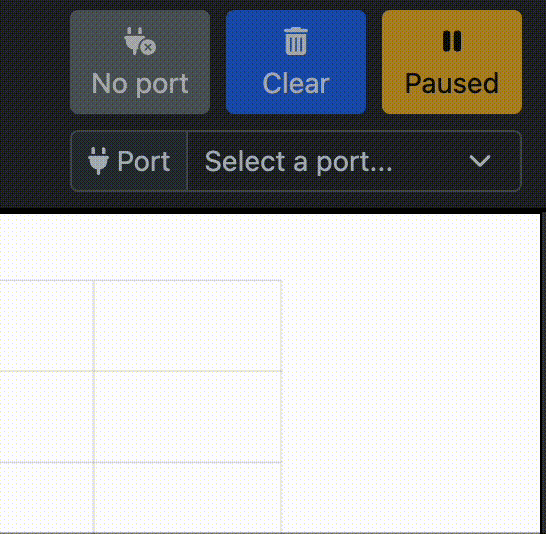
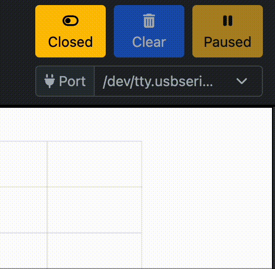

# First Steps

## Open a port
1. Select the send tab (This will spawn the graph)
2. Plug in a SPIN or an Arduino talking on the serial port.
if you want to test this, sample programs will be available later.
3. Select the corresponding serial port in the port dropdown
	=== "Windows"
		The port will start with *COM*
		TODO: PIC { width="300" }

	=== "macOS"
		The port will most likely start with */dev/tty.usbserial* but your mileage may vary.
		{ width="300" }

	=== "Linux"
		The port will most likely start with */dev/tty.usb* but your mileage may vary.
		TODO: PIC { width="300" }

4. Open the port by clicking the "Open" button

	{ width="300" }

5. You should observe the data coming from the serial port in the terminal and data points should appear on the graph.

!!! warning "Troubleshooting"
	* if you have trouble seeing the desired port, check out the [troubleshooting guide](troubleshooting.md#Port finding)

