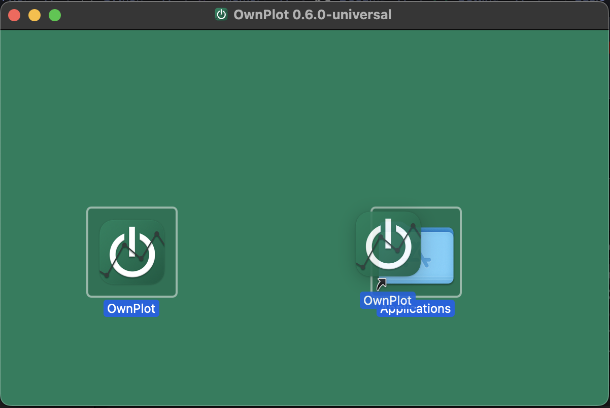
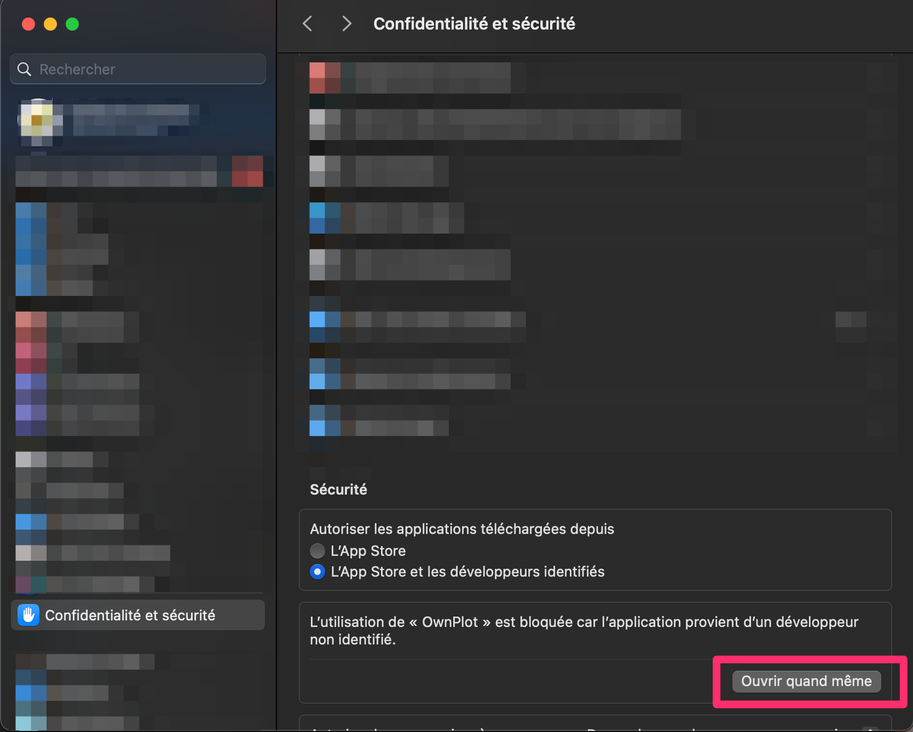




# Download
All OwnPlot releases can be downloaded on [github](https://github.com/owntech-foundation/OwnPlot/releases)

=== "Windows"

	Download the file [{{ win_exe }}]({{ win_url }})

=== "macOS"
	This works with Intel & Apple silicon

	Download the file [OwnPlot.Setup.{{ ownplot.version }}.exe](https://github.com/owntech-foundation/OwnPlot/releases/download/release-{{ ownplot.version }}/OwnPlot-{{ ownplot.version }}-universal.dmg)

=== "Linux (Debian based)"

	Download the file [OwnPlot.Setup.{{ ownplot.version }}.exe](https://github.com/owntech-foundation/OwnPlot/releases/download/release-{{ ownplot.version }}/OwnPlot-{{ ownplot.version }}_amd64.deb)

=== "Linux (RedHat based)"

	Download the file [OwnPlot.Setup.{{ ownplot.version }}.exe](https://github.com/owntech-foundation/OwnPlot/releases/download/release-{{ ownplot.version }}/OwnPlot-{{ ownplot.version }}.x86_64.rpm)

=== "Linux (AppImage)"

	Download the file [OwnPlot.Setup.{{ ownplot.version }}.exe](https://github.com/owntech-foundation/OwnPlot/releases/download/release-{{ ownplot.version }}/OwnPlot-{{ ownplot.version }}.AppImage)


# Installation

=== "Windows"

	1. Launch the executable *OwnPlot.Setup.{{ ownplot.version }}.exe*
	2. The app will automatically install in the `User\AppData\Local\Programs\OwnPlot` folder
	3. OwnPlot should launch itself right after the installation has been completed.
	4. OwnPlot should be available from the start menu

=== "macOS"
	!!! success "Compatibility"
		This works with Intel & Apple silicon
	
	1. Launch the disk image *OwnPlot-{{ ownplot.version }}-universal.dmg*
	2. Drag and drop OwnPlot into your Applications folder 
	
	3. Launch OwnPlot from your Application folder or the LaunchPad

	!!! note "If you have trouble running the app for the first time"
		1. If you get this:

		{ width="300" }

		2. Open System Preferences
		3. Go to *Security & Privacy* Tab
		4. Allow OwnPlot to run by clicking the button "Allow"
		

=== "Linux (Debian based)"
	1. Open a terminal
	2. Install the package
	``` shell
	sudo dpkg -i OwnPlot_{{ ownplot.version }}_amd64.deb
	```

=== "Linux (RedHat based)"
	!!! warning
		This install has not been tested yet

	1. Open a terminal
	2. Install the package
	``` shell
	sudo rpm -i OwnPlot_{{ ownplot.version }}_amd64.rpm
	```

=== "Linux (AppImage)"
	1. Double-click on the AppImage file
	!!! note "If you have trouble running the AppImage"

		1. Open a terminal
		2. Allow the file to be executed by running this command
		``` shell
		chmod u+x OwnPlot-{{ ownplot.version }}.AppImage
		```

!!! warning "Performances issues"

	As of today, The last version available is [v0.6.0](https://github.com/owntech-foundation/OwnPlot/releases/tag/release-0.6.0).

	However, **v0.6.0** has been reported to have a low-performance. If you have trouble running this release, fall back on version [v0.5.1](https://github.com/owntech-foundation/OwnPlot/releases/tag/release-0.5.1)


Great! Now that you have OwnPlot installed and all setup, we can proceed