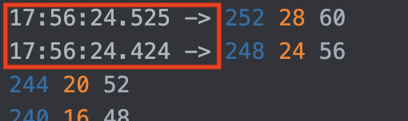

# OwnPlot's terminal
Understanding OwnPlot's terminal and its features.

# Settings
## A quick word
As of today, the terminal is not independent. It relies on the graph data to show information.
Consequently, some settings are linked with the graph. Moreover, the data is coming from the port, so a lot of standard settings for this type of application are related to the port.

## Main terminal's settings section
{ width="300" }

Most of the terminal settings live under the **Settings** tab.

### Lines history
To set the maximum number of lines stored in the terminal, enter a number between 0 and 1000 in the input field **# Lines**
{ width="300" }

### Timestamp
The timestamp option permits to log the time aside of the data.
It is enabled by default (green button) and can be disabled by pressing the timestamp button (it will become yellow).

The timestamp in the terminal is the part preceding the data.
